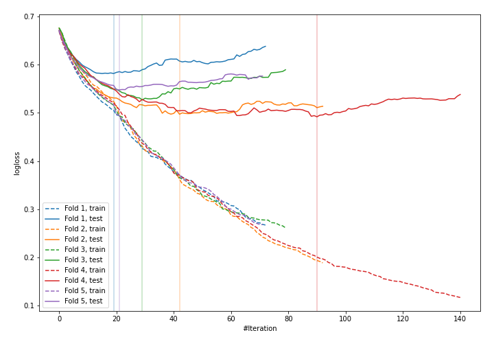
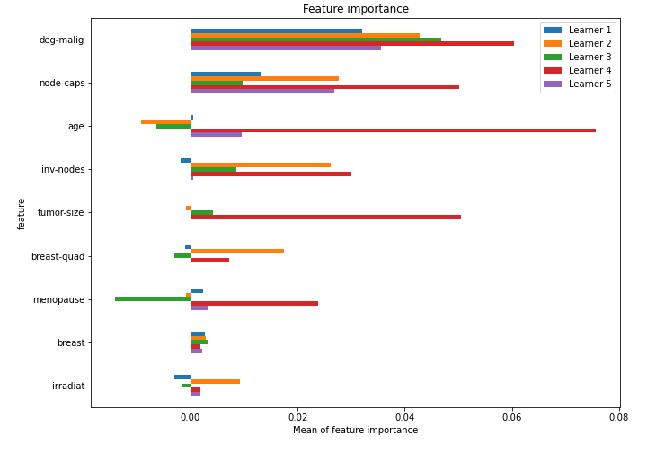

# Summary of 4_Default_CatBoost

[<< Go back](../README.md)

## CatBoost
- **n_jobs**: -1
- **learning_rate**: 0.1
- **depth**: 6
- **rsm**: 1
- **loss_function**: Logloss
- **explain_level**: 1

## Validation
 - **validation_type**: kfold
 - **k_folds**: 5
 - **shuffle**: True
 - **stratify**: True

## Optimized metric
logloss

## Training time

4.2 seconds

## Metric details
|           |    score |   threshold |
|:----------|---------:|------------:|
| logloss   | 0.529719 | nan         |
| auc       | 0.720009 | nan         |
| f1        | 0.547771 |   0.263918  |
| accuracy  | 0.767544 |   0.502323  |
| precision | 0.8      |   0.502323  |
| recall    | 1        |   0.0488281 |
| mcc       | 0.353672 |   0.502323  |

## Confusion matrix (at threshold=0.502323)
|                     |   Predicted as negative |   Predicted as positive |
|:--------------------|------------------------:|------------------------:|
| Labeled as negative |                     159 |                       4 |
| Labeled as positive |                      49 |                      16 |

## Learning curves

## Permutation-based Importance

[<< Go back](../README.md)
