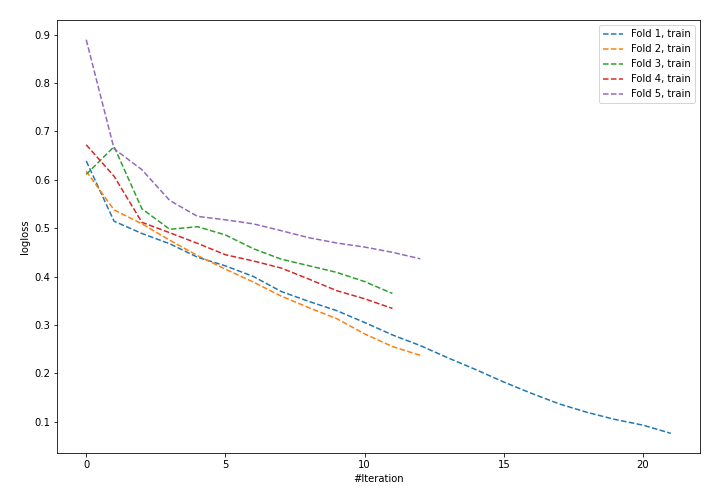
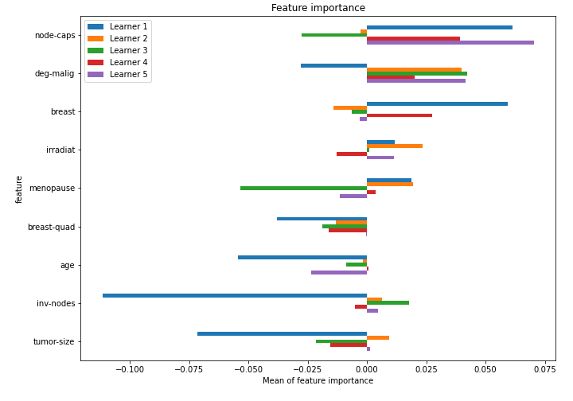

# Summary of 5_Default_NeuralNetwork

[<< Go back](../README.md)

## Neural Network
- **n_jobs**: -1
- **dense_1_size**: 32
- **dense_2_size**: 16
- **learning_rate**: 0.05
- **explain_level**: 1

## Validation
 - **validation_type**: kfold
 - **k_folds**: 5
 - **shuffle**: True
 - **stratify**: True

## Optimized metric
logloss

## Training time

1.7 seconds

## Metric details
|           |    score |    threshold |
|:----------|---------:|-------------:|
| logloss   | 0.707808 | nan          |
| auc       | 0.585937 | nan          |
| f1        | 0.454212 |   0.0326242  |
| accuracy  | 0.710526 |   0.565898   |
| precision | 0.461538 |   0.565898   |
| recall    | 1        |   0.00151926 |
| mcc       | 0.147139 |   0.263716   |

## Confusion matrix (at threshold=0.565898)
|                     |   Predicted as negative |   Predicted as positive |
|:--------------------|------------------------:|------------------------:|
| Labeled as negative |                     156 |                       7 |
| Labeled as positive |                      59 |                       6 |

## Learning curves

## Permutation-based Importance

[<< Go back](../README.md)
